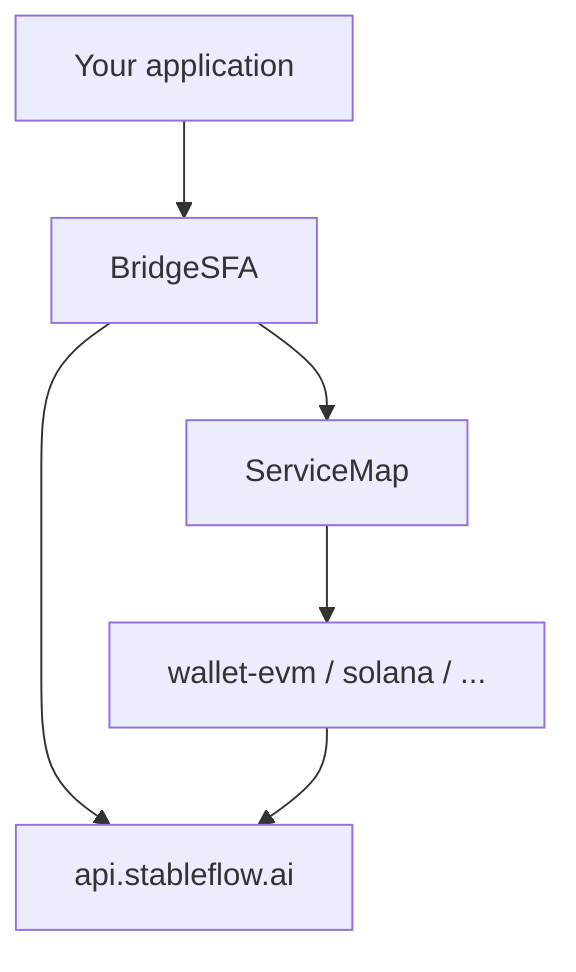

# StableFlow SDK — Developer Guide

This guide covers integrating the StableFlow TypeScript SDK monorepo: package layout, quoting, sending transactions, multi-chain wallets, and Hyperliquid deposits.

## Table of contents

1. [Overview](#overview)
2. [Configuration](#configuration)
3. [Quote performance: the `dry` flag](#quote-performance-the-dry-flag)
4. [SFA — direct HTTP API](#sfa--direct-http-api)
5. [BridgeSFA — full cross-chain flows](#bridgesfa--full-cross-chain-flows)
6. [Wallet adapters](#wallet-adapters)
7. [Hyperliquid](#hyperliquid)
8. [Troubleshooting](#troubleshooting)

---

## Overview

The monorepo is split into focused packages:

| Package | Role |
|---------|------|
| `@stableflow/core` | API client, models, token/chain config, `SFA` |
| `@stableflow/bridges` | `BridgeSFA`, `ServiceMap`, all bridge route implementations |
| `@stableflow/wallet-*` | Per-chain `WalletConfig` adapters (sign, send, approve, quote simulation) |
| `@stableflow/utils-evm` / `@stableflow/utils-solana` | Internal RPC and protocol helpers |
| `@stableflow/hyperliquid` | Hyperliquid deposit flow on top of OneClick + Arbitrum USDC permit |

**Typical integration path**

1. Install `@stableflow/core` + `@stableflow/bridges` + the wallet package(s) for your chains.
2. Construct a wallet adapter and pass `wallet.wallet` (`WalletConfig`) into `BridgeSFA`.
3. Call `BridgeSFA.getAllQuote` with `dry: true` to compare routes quickly.
4. Re-quote the chosen route with `dry: false`, then `BridgeSFA.send`.

For HTTP-only access (tokens list, simple OneClick quote/status), `SFA` on `@stableflow/core` is sufficient.



---

## Configuration

### Authentication

**JWT Token**: Required for API access

**👉 [Apply for JWT Token](https://docs.google.com/forms/u/3/d/e/1FAIpQLSdTeV7UaZ1MiFxdJ2jH_PU60PIN3iqYJ1WXEOFY45TsAy6O5g/viewform)**

After receiving the token, set it before API calls:

```ts
import { OpenAPI } from '@stableflow/core';

OpenAPI.TOKEN = 'your-jwt-token';
```

### RPC URLs (optional)

Bridge quotes and sends may read chain state (balances, gas, ATA existence). Override RPC endpoints if needed:

```ts
import { setRpcUrls } from '@stableflow/core';

setRpcUrls({
  eth: ['https://your-eth-rpc.example.com'],
  arb: ['https://your-arb-rpc.example.com'],
  sol: ['https://your-solana-rpc.example.com'],
});
```

Use `getChainRpcUrl(chainKey)` to read the active URL(s) for a chain.

---

## Quote performance: the `dry` flag

The `dry` flag is the most important tuning knob for quote latency.

### API semantics (`QuoteRequest`)

For OneClick / HTTP quotes, `QuoteRequest.dry` is documented as follows:

- **`dry: true`** — dry run. The response does **not** include `depositAddress`, `timeWhenInactive`, or `deadline`.
- **`dry: false`** — full quote with a real deposit address and deadlines.

Because generating deposit addresses and running heavier validation is slower, **`dry: true` is recommended for route comparison and UI previews**. Switch to **`dry: false` only when the user is ready to deposit or you are about to call `send`**.

### Bridge and wallet layers

`BridgeSFA.getAllQuote` forwards `dry` to every eligible route in `ServiceMap`. Individual wallet adapters also branch on `dry`:

- **EVM**: skips or simplifies gas estimation paths when `dry: true` (e.g. uses default gas limits instead of live estimates).
- **Solana / Tron / others**: may skip building or broadcasting transactions when `dry: true`.

### Recommended pattern

```ts
// 1) Fast scan — compare all routes
const previews = await BridgeSFA.getAllQuote({
  ...params,
  dry: true,
});

const best = previews
  .filter((r) => r.quote && !r.error)
  .sort(/* your comparator */)[0];

// 2) Final quote — deposit address + accurate send params
const [final] = await BridgeSFA.getAllQuote({
  ...params,
  dry: false,
  singleService: best.serviceType,
});

// 3) Approve (if quote.needApprove) then send
const txHash = await BridgeSFA.send(best.serviceType, {
  wallet: wallet.wallet,
  quote: final.quote,
});
```

`Hyperliquid.quote` defaults to `dry: true` for the same reason; pass `dry: false` before `transfer`.

> **Note:** The [demo-evm](examples/demo-evm/src/App.tsx) example uses `dry: false` in `handleGetQuote` for simplicity so deposit addresses appear immediately. Production apps should prefer the two-step pattern above.

---

## SFA — direct HTTP API

`SFA` in `@stableflow/core` wraps StableFlow REST endpoints. Use it when you do not need multi-route wallet orchestration.

| Method | Endpoint | Purpose |
|--------|----------|---------|
| `SFA.getTokens()` | `GET /v0/tokens` | Supported assets |
| `SFA.getQuote(body)` | `POST /v0/quote` | Single swap quote (`QuoteRequest`) |
| `SFA.getExecutionStatus(depositAddress, depositMemo?)` | `GET /v0/status` | Swap status by deposit address |
| `SFA.submitDepositTx(body)` | `POST /v0/deposit/submit` | Notify OneClick deposit tx hash |

Example:

```ts
import { SFA, QuoteRequest } from '@stableflow/core';

const tokens = await SFA.getTokens();

const quote = await SFA.getQuote({
  dry: true,
  swapType: QuoteRequest.swapType.EXACT_INPUT,
  slippageTolerance: 50, // basis points
  originAsset: '...',
  destinationAsset: '...',
  amount: '1000000',
  refundTo: '0x...',
  refundType: QuoteRequest.refundType.ORIGIN_CHAIN,
  recipient: '0x...',
  recipientType: QuoteRequest.recipientType.DESTINATION_CHAIN,
  depositType: QuoteRequest.depositType.ORIGIN_CHAIN,
  deadline: new Date(Date.now() + 3600_000).toISOString(),
});
```

For full cross-chain bridge flows (multiple services, wallet-signed sends), use **`BridgeSFA`** instead.

---

## BridgeSFA — full cross-chain flows

Install `@stableflow/bridges` with `@stableflow/core` and at least one `@stableflow/wallet-*` package.

### Services

Routes are identified by `Service` from `@stableflow/core`:

| `Service` | Description |
|-----------|-------------|
| `oneclick` | NEAR Intents / OneClick |
| `usdt0` | LayerZero USDT0 (USD₮0) |
| `cctp` | Circle CCTP |
| `fraxzero` | FraxZero |
| `usdt0-oneclick` / `oneclick-usdt0` | Composite USDT0 ↔ OneClick |
| `fraxzero-oneclick` / `oneclick-fraxzero` | Composite FraxZero ↔ OneClick |
| `native` | Native transfers |

`BridgeSFA.getAllQuote` discovers eligible services from token metadata (`fromToken.services`, `toToken.services`) and composite rules in `packages/bridges/src/sfa.ts`.

### `getAllQuote`

```ts
import { BridgeSFA, type GetAllQuoteParams } from '@stableflow/bridges';
import { tokens } from '@stableflow/core';

const params: GetAllQuoteParams = {
  dry: true,
  prices: { ETH: '3000', SOL: '120', BNB: '900' }, // USD prices for fee display
  fromToken, // TokenConfig from tokens registry
  toToken,
  wallet: sourceWallet.wallet,
  recipient: '0xRecipient...',
  refundTo: '0xRefund...',
  amountWei: '1000000',
  slippageTolerance: 0.5, // percent; multiplied by 100 for OneClick routes
  minInputAmount: '1',
  oneclickParams: {
    appFees: [{ recipient: 'your.near', fee: 100 }],
    swapType: 'EXACT_INPUT',
  },
  // Optional: restrict or disable routes
  // singleService: Service.OneClick,
  // disabledServices: [Service.CCTP],
  // EVM helper wallet for cross-vm permits
  evmWallet: evmAdapter.wallet,
  evmAddress: '0x...',
};

const results = await BridgeSFA.getAllQuote(params);
// { serviceType, quote?, error? }[]
```

**`prices`** — map of native gas token symbols to USD price strings; used when estimating fees in quotes.

**`oneclickParams`** — preferred over deprecated top-level `appFees`. Slippage for OneClick routes is `slippageTolerance * 100` (basis points) inside `BridgeSFA`.

### `send`

```ts
import { BridgeSFA } from '@stableflow/bridges';
import { getQuoteModes } from '@stableflow/bridges';

const { isExactOutput } = getQuoteModes({
  quoteData: quote,
  bridgeStore: { quoteDataService: serviceType },
});

// Handle quote.needApprove via wallet.approve(...) first

const txHash = await BridgeSFA.send(serviceType, {
  wallet: sourceWallet.wallet,
  quote,
  permitSignature, // required when quote.needPermit
});
```

`send` delegates to `ServiceMap[serviceType].send`, then best-effort reports the trade via `POST /v0/trade/add`.

### `getStatus`

```ts
import { BridgeSFA } from '@stableflow/bridges';
import { Service, TransactionStatus } from '@stableflow/core';

const { status, toChainTxHash } = await BridgeSFA.getStatus(Service.OneClick, {
  depositAddress: quote.quote.depositAddress,
});

// status: TransactionStatus.Pending | Success | Failed
```

Supported status normalization varies by service (OneClick, USDT0, CCTP) — see `packages/bridges/src/sfa.ts`.

### Low-level `ServiceMap`

For advanced use, import individual bridge modules through `ServiceMap`:

```ts
import { ServiceMap } from '@stableflow/bridges';
import { Service } from '@stableflow/core';

const quote = await ServiceMap[Service.Usdt0].quote({ dry: true, ... });
```

---

## Wallet adapters

Each `@stableflow/wallet-*` package exports a class that wraps your chain SDK and exposes `.wallet: WalletConfig`.

| Chain | Package | Export |
|-------|---------|--------|
| EVM | `@stableflow/wallet-evm` | `EVMWallet` |
| Solana | `@stableflow/wallet-solana` | `SolanaWallet` |
| NEAR | `@stableflow/wallet-near` | `NearWallet` |
| TON | `@stableflow/wallet-ton` | `TonWallet` |
| Aptos | `@stableflow/wallet-aptos` | `AptosWallet` |
| Tron | `@stableflow/wallet-tron` | `TronWallet` |
| Sui | `@stableflow/wallet-sui` | `SuiWallet` |

### Integration pattern

```ts
import { EVMWallet } from '@stableflow/wallet-evm';
import { BridgeSFA } from '@stableflow/bridges';
import { tokens } from '@stableflow/core';

const evm = new EVMWallet(/* wagmi / ethers signer */);

const fromToken = tokens.find((t) => t.chainName === 'Ethereum' && t.symbol === 'USDT');
const toToken = tokens.find((t) => t.chainName === 'Arbitrum' && t.symbol === 'USDC');

const quotes = await BridgeSFA.getAllQuote({
  dry: true,
  prices: { ETH: '3000' },
  fromToken: fromToken!,
  toToken: toToken!,
  wallet: evm.wallet,
  recipient: await evm.getAddress(),
  refundTo: await evm.getAddress(),
  amountWei: '100000000', // 100 USDT (6 decimals)
  slippageTolerance: 0.5,
  evmWallet: evm.wallet,
  evmAddress: await evm.getAddress(),
});
```

`WalletConfig` methods (approve, transfer, signTypedData, etc.) are invoked by bridge services during `quote` and `send`. See each package README for peer dependencies (LayerZero, Solana web3, TronWeb, etc.).

### Token registry

Use `tokens`, `usdtChains`, `usdcChains`, and related exports from `@stableflow/core` rather than hardcoding contract addresses. Each `TokenConfig` includes `services` — the list of `Service` values valid for that asset.

---

## Hyperliquid

`@stableflow/hyperliquid` deposits assets into Hyperliquid via OneClick into **USDC on Arbitrum**.

### Constraints

- **Minimum amount**: `HyperliuquidMinAmount` (export name retains a typo — use this exact symbol).
- **Destination**: `HyperliuquidToToken` — USDC on Arbitrum.
- **Sources**: `HyperliquidFromTokens` — all supported tokens except Arbitrum USDC.

### End-to-end flow

```ts
import { Hyperliquid, HyperliuquidMinAmount } from '@stableflow/hyperliquid';
import { EVMWallet } from '@stableflow/wallet-evm';
import SolanaWallet from '@stableflow/wallet-solana';

// 1) Quote (fast)
let { quote, error } = await Hyperliquid.quote({
  dry: true,
  fromToken,
  wallet: sourceWallet.wallet,
  recipient: hyperliquidAddress,
  refundTo: sourceAddress,
  amountWei: '10000000',
  slippageTolerance: 0.5,
  prices: { SOL: '120' },
});

// 2) Final quote with deposit address
({ quote, error } = await Hyperliquid.quote({ ...params, dry: false }));

// 3) Source-chain transfer to deposit address
const txhash = await Hyperliquid.transfer({
  wallet: sourceWallet.wallet,
  evmWallet: arbWallet.wallet,
  evmWalletAddress: arbAddress,
  quote,
});

// 4) Arbitrum USDC permit + register deposit
const depositRes = await Hyperliquid.deposit({
  wallet: sourceWallet.wallet,
  evmWallet: arbWallet.wallet,
  evmWalletAddress: arbAddress,
  quote,
  txhash,
});

const depositId = String(depositRes.data.depositId);

// 5) Poll status
const status = await Hyperliquid.getStatus({ depositId });
// status.data.status: PROCESSING | SUCCESS | REFUNDED | FAILED
```

`transfer` uses `ServiceMap[Service.OneClick].send`. `deposit` signs an EIP-2612-style permit on Arbitrum USDC and posts to `POST /v0/deposit`.

---

## Troubleshooting

| Symptom | Likely cause | What to do |
|---------|--------------|------------|
| `401 Unauthorized` | Missing or invalid JWT | Set `OpenAPI.TOKEN` |
| `Invalid parameters` from `getAllQuote` | Missing token, recipient, or amount below `minInputAmount` | Validate `TokenConfig`, addresses, `amountWei` |
| `Token pair not supported` | Tokens not in `tokens` registry or no shared service | Pick supported pair from `tokens` / `SFA.getTokens()` |
| All quotes return `error` | Route disabled, insufficient liquidity, or `dry: false` required | Try `dry: true` first; read per-route `error` strings |
| `Permit signature is required` | Route needs EIP-2612 permit | Sign and pass `permitSignature` to `BridgeSFA.send` |
| Slow quote UI | Using `dry: false` for every route | Use `dry: true` for comparison; `singleService` + `dry: false` for final quote |
| RPC / gas failures | Default RPC unreachable | `setRpcUrls` with reliable endpoints |
| Hyperliquid `Amount is too low` | Below `HyperliuquidMinAmount` | Increase `amountWei` |

---

## Package documentation

- [Monorepo README](README.md)
- [@stableflow/core](packages/core/README.md)
- [@stableflow/bridges](packages/bridges/README.md)
- [Wallet packages](packages/wallet-evm/README.md)
- [@stableflow/hyperliquid](packages/hyperliquid/README.md)
- [demo-evm](examples/demo-evm/README.md)
